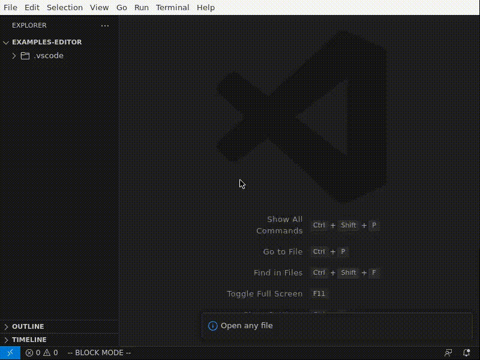

# Changelog

# 0.7.0

Finally, switched to `node-tree-sitter`! 🎉

This means faster parsing, faster language installation, and no need for
`docker`, or `emscripten`.

## Added

- `c` ([#33](https://github.com/selfint/code-blocks/issues/33)) support, and
  `svelte` ([#170](https://github.com/selfint/code-blocks/issues/170))
  using the excellent
  [@tree-sitter-grammars](https://github.com/tree-sitter-grammars) project.

- Many more languages are now tested in advance: 
  Rust, TypeScript, TSX, JavaScript, Java, Python, Svelte, C, C++, C#,
  Go, Ruby, HTML, CSS, YAML, JSON, Markdown, Bash, Kotlin, Zig.

## Changed

- Switched to `node-tree-sitter` from `web-tree-sitter` 
  ([#125](https://github.com/selfint/code-blocks/issues/125)).
  This means that the extension no longer requires `emcc` or `docker` to be installed.

- `tree-sitter` CLI is now optional, and only required if the extension cannot find
  a pre-built parser.

## Deprecated

- Support for `node` v16, it might still work, but the extension now
  requires `node` v18+.

## Fixed

- If local parser installation is corrupt, add 'Remove' option to notification.

# 0.6.1

## Added

- `codeBlocks.treeSitterCliPath` configuration: Set path to `tree-sitter` command.

# 0.6.0

## Added

- Block mode now supports all `tree-sitter` supported languages by default: Queries
  are only required for the Code Blocks Editor.

- `node` + `npm` dependency: Extension new requires `node` v16+, and `npm`.

- `tree-sitter-cli` dependency: Extension now requires `tree-sitter-cli`, and so
  transitively requires either `emscripten` (preferred) or `docker`.

- Tree viewer: View the syntax tree of the current file.

  

- Block mode highlights can be toggled.

## Fixed

- Rapidly toggling block mode breaks extension.

- Rapidly moving blocks is slow.

## Changed

- Block mode blocks: Instead of only using blocks, block mode now has
  access to all nodes in the syntax tree. Blocks are now only used to automatically
  expand a selection.

  ### Fine grained selection of nodes

  

  ### Selection expansion to nearest block

  

- Simplify language config:

  - Parsers are now installed from NPM, instead of from GitHub.
  - By default, the extension will try to use the `tree-sitter-<language>` NPM package, so
    many languages will not need to be configured at all.
  - Queries are an optional config, required only for the Code Blocks Editor (not for
    Block Mode) to work.
  - Configuration is by `[languageId]` instead of a massive `languageSupport` config.

- Change Block Mode colors config:

  - `codeBlocks.colors.enabled`: Whether Block Mode should color selections or not. Defaults to `false`.
  - `codeBlocks.colors.sibling`: CSS string for sibling selection background color. Defaults to `var(--vscode-editor-selectionHighlightBackground)`.
  - `codeBlocks.colors.parent`: CSS string for parent selection background color. Defaults to `var(--vscode-editor-linkedEditingBackground)`.

  ### Old config for Python and TSX

  ```json
  "codeBlocks.languageSupport": {
    "python": {
      "parserInstaller": {
        "downloadCmd": "git clone https://github.com/tree-sitter/tree-sitter-python",
        "libraryName": "tree_sitter_python",
        "languageFnSymbol": "language"
      },
      "queries": [
        "(class_definition) @item",
        "(function_definition) @item",
        "(decorated_definition) @item"
      ]
    },
    "typescriptreact": {
      "parserInstaller": {
          "downloadCmd": "git clone https://github.com/tree-sitter/tree-sitter-typescript",
          "symbol": "language_tsx",
          "name": "tree_sitter_typescript"
      },
      "queries": [
          "( (comment)* @header . (class_declaration) @item)",
          "( (comment)* @header . (method_definition) @item)",
          "( (comment)* @header . (function_declaration) @item)",
          "( (comment)* @header . (export_statement) @item)",
          "(jsx_element) @item",
          "(jsx_self_closing_element) @item"
      ]
    }
  }
  ```

  ### New config for Python and TSX

  ```json
  "[python]": {
    // single-node blocks are only for the Code Blocks Editor
    "codeBlocks.queries": [
      "(class_definition) @item",
      "(function_definition) @item",
      "(decorated_definition) @item"
    ]
  },

  // parser is configured inside each languageId's config
  "[typescriptreact]": {
    "codeBlocks.npmPackageName": "tree-sitter-typescript",
    "codeBlocks.parserName": "tree-sitter-tsx",
    "codeBlocks.subdirectory": "tsx",
    // queries are now optional
    "codeBlocks.queries": [
      "( (comment)* @header . (class_declaration) @item)",
      "( (comment)* @header . (method_definition) @item)",
      "( (comment)* @header . (function_declaration) @item)",
      "( (comment)* @header . (export_statement) @item)",
      // single-node blocks are only for the Code Blocks Editor
      "(jsx_element) @item",
      "(jsx_self_closing_element) @item"
    ]
  }
  ```

## Removed

- Rust dependencies: `cargo`, `code-blocks-server`, no longer required.

- Force moves: Were inconsistent (especially in indent-based languages) and rarely useful.

  > If they are missed, please [comment on this issue](https://github.com/selfint/code-blocks/issues/160), preferably with your use case.

# 0.5.2

## Fixed

- Block Mode: Moving blocks rapidly is unstable.
- Python: Force move can cause syntax errors.

# 0.5.1

## Added

- Add block navigation commands:

  Regular "navigate" commands will not navigate to parent scope,
  for that there are the "force navigate" commands.

  

- Make "block mode" a vscode context (useful for keybindings).

- Add "block mode" status bar indicator.

- Add "select current block" command:

  

- Add configurable colors:

  Default values:

  ```json
  "codeBlocks.colors": {
    "selected": "var(--vscode-inputOption-activeBackground)",
    "target": "var(--vscode-editor-selectionHighlightBackground)",
    "forceTarget": "var(--vscode-editor-linkedEditingBackground)"
  }
  ```

  Each value is a css string that is passed to the `background-color` property
  of the respective block type. It can be any valid css value.

- Add default keybindings (only active when "block mode" is on):

  | Command                        | Keybinding (cmd on mac) |
  | ------------------------------ | ----------------------- |
  | `codeBlocks.moveUp`            | `alt+up`                |
  | `codeBlocks.moveDown`          | `alt+down`              |
  | `codeBlocks.moveUpForce`       | `alt+shift+up`          |
  | `codeBlocks.moveDownForce`     | `alt+shift+down`        |
  | `codeBlocks.navigateUp`        | `ctrl/cmd+up`           |
  | `codeBlocks.navigateDown`      | `ctrl/cmd+down`         |
  | `codeBlocks.navigateUpForce`   | `ctrl/cmd+shift+up`     |
  | `codeBlocks.navigateDownForce` | `ctrl/cmd+shift+down`   |

  Note that `codeBlocks.toggle`, the old editor commands, and
  `codeBlocks.selectBlock` are not bound by default.

## Fixed

- Blocks appearing in files with unsupported languages.

## Changed

- Change "force" semantics:

  Blocks that require a force move/navigate are detected in advance,
  and trying to move/navigate to them will fail silently. Instead of
  the old error notification, the background of the blocks is
  now a different color.

# 0.5.0

## Added

- Add "block mode":

  

## Fixed

- `code-blocks-cli` not updated between vscode extension versions.

- "Installing tree_sitter_XXX" notification on every command.

- Spacing around blocks in the Editor view too small.
