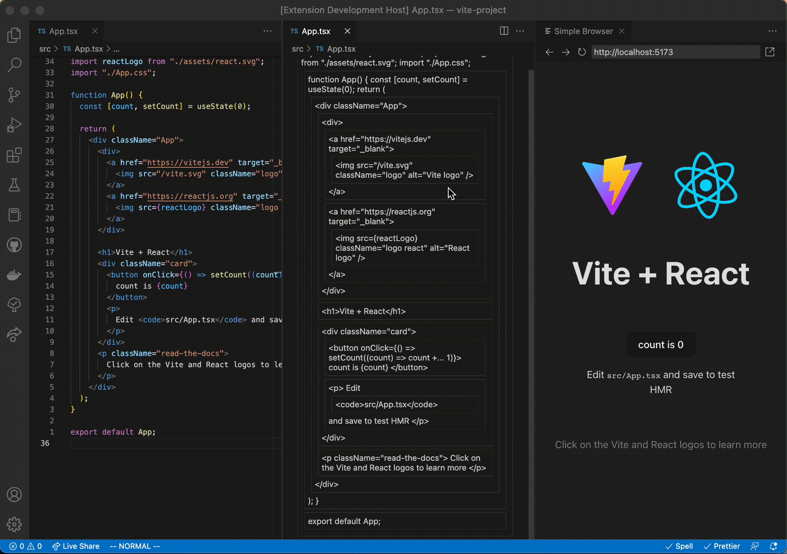
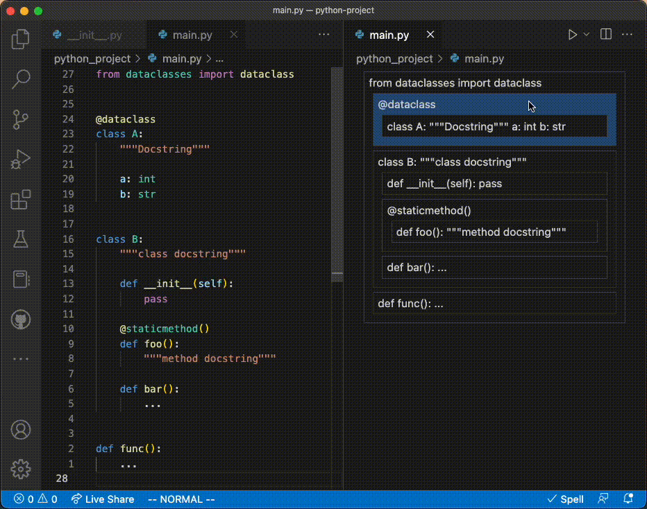

# code-blocks

Manipulate code as blocks.

Supports any language with a [tree-sitter](https://github.com/tree-sitter) grammar.

## Example - vscode extension

See the [vscode extension README](./vscode-extension/README.md) for more info.

### Typescript + JSX (React)



> Quickly change UI layout

### Python



> Prevents syntax/logic errors by preserving block scope

### Rust


> Docs and attributes are part of the block

### Language support configuration

Adding support for a language that isn't configured by default (yet) is minimal:

- `parserInstaller` tells the extension how to use the grammar.
- `queries` tells the extension how to find the blocks in [tree-sitter Query syntax](https://tree-sitter.github.io/tree-sitter/using-parsers#query-syntax).

Also, please submit a Pull Request to add your configuration to the [default extension config](./vscode-extension/package.json).

### Typescript + React (JSX) support:

```json
"typescriptreact": {
    "parserInstaller": {
        "downloadCmd": "git clone https://github.com/tree-sitter/tree-sitter-typescript",
        "symbol": "language_tsx",
        "name": "tree_sitter_typescript"
    },
    "queries": [
        "( (comment)* @header . (class_declaration) @item)",
        "( (comment)* @header . (method_definition) @item)",
        "( (comment)* @header . (function_declaration) @item)",
        "( (comment)* @header . (export_statement) @item)",
        "(jsx_element) @item",
        "(jsx_self_closing_element) @item"
    ]
}
```
