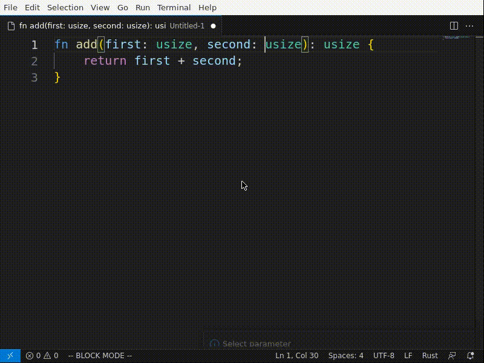
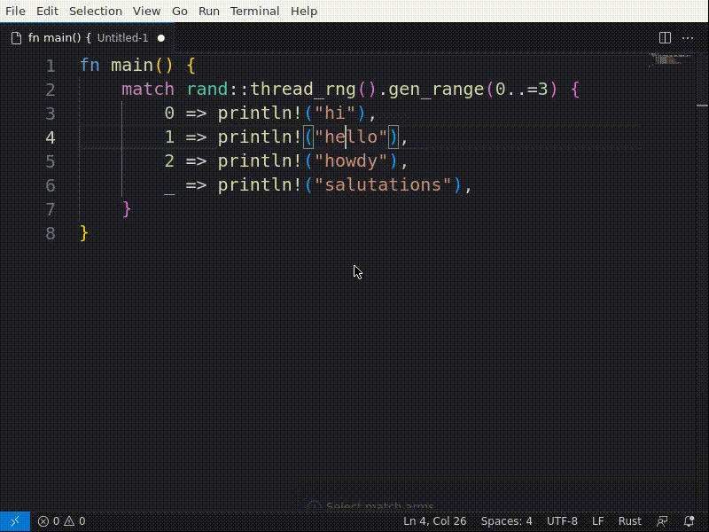
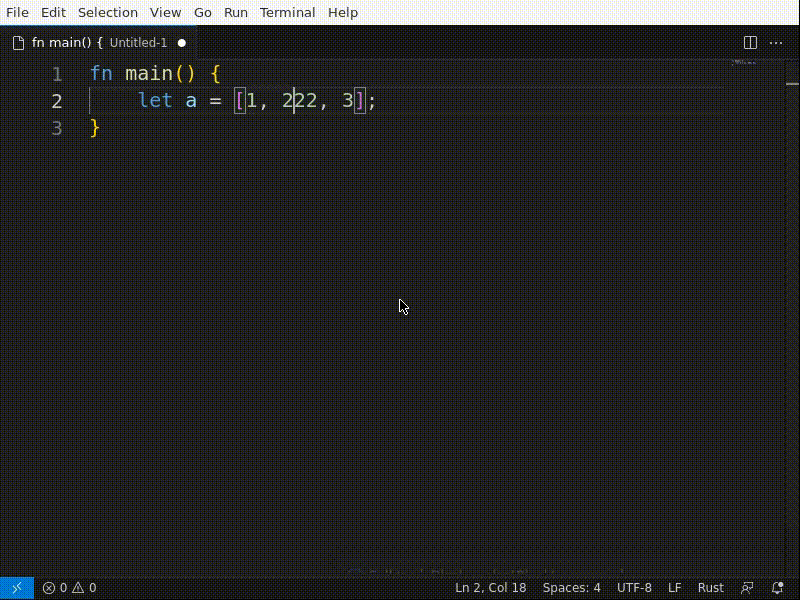
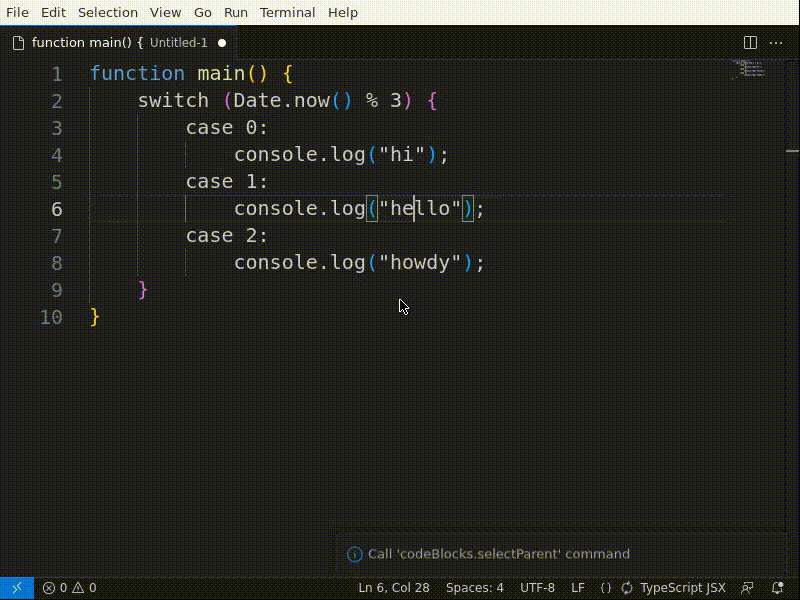
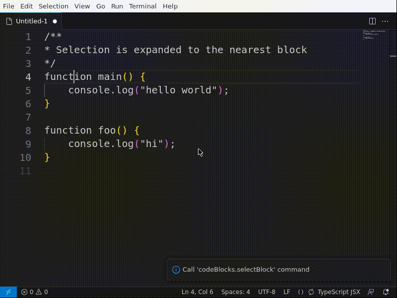

<p align="center">
<a href="https://github.com/selfint/code-blocks">

</a>
</p>

<p align="center">
<a href="https://marketplace.visualstudio.com/items?itemName=selfint.code-blocks" target="__blank"></a>
<a href="https://marketplace.visualstudio.com/items?itemName=selfint.code-blocks" target="__blank"></a>
<a href="https://marketplace.visualstudio.com/items?itemName=selfint.code-blocks" target="__blank"></a>
<a href="https://github.com/selfint/code-blocks/actions/workflows/ci-cd.yml" target="__blank"></a>
<a href="https://github.com/selfint/code-blocks" target="__blank"></a>
<a href="https://github.com/selfint/code-blocks/issues" target="__blank"></a>
<a href="https://github.com/selfint/code-blocks/stargazers" target="__blank"></a>
</p>

<br>

<h1><p align="center">Code blocks</p></h1>

Supercharge your editor with syntactically aware code navigation and manipulation, **_in any language_** supported by [tree-sitter](https://tree-sitter.github.io/tree-sitter/#parsers).

## Features

### Block mode

Syntactically aware code selection (e.g. select scope), navigation (e.g. goto next function) and manipulation (e.g. re-order function parameters), right inside your editor.



### Code Blocks Editor

Bird's-eye view over all your code blocks, with point and click refactoring.


### Tree viewer

View your code's syntax tree directly


## Requirements

- `npm`: Used to download and build tree-sitter language parsers. Can be installed from [here](https://nodejs.org/en/download). Must be in `PATH`.

### Note

The extension **used** to require `emcc` (Emscripten compiler) or `docker` to compile tree-sitter parsers to WASM. **This is no longer required**.

## Commands

| Command                            | Usage                                                           |
| ---------------------------------- | --------------------------------------------------------------- |
| `codeBlocks.toggleActive`          | Toggle auto-parsing current file                                |
| `codeBlocks.toggleBlockMode`       | Toggle Block Mode, will `toggleActive` if auto-parsing disabled |
| `codeBlocks.toggleBlockModeColors` | Toggle Block Mode sibling/parent highlights                     |
| `codeBlocks.open`                  | Reopen current file with Code Blocks editor                     |
| `codeBlocks.openToTheSide`         | Open current file with Code Blocks editor on the side           |
| `codeBlocks.openTreeViewer`        | View current file syntax tree                                   |
| `codeBlocks.moveUp`                | Swap block with its previous sibling                            |
| `codeBlocks.moveDown`              | Swap block with its next sibling                                |
| `codeBlocks.navigateUp`            | Navigate to previous sibling                                    |
| `codeBlocks.navigateDown`          | Navigate to next sibling                                        |
| `codeBlocks.navigateUpForce`       | Navigate to parent start                                        |
| `codeBlocks.navigateDownForce`     | Navigate to parent end                                          |
| `codeBlocks.selectBlock`           | Expand selection to previous sibling                            |
| `codeBlocks.selectPrevious`        | Expand selection to previous sibling                            |
| `codeBlocks.selectNext`            | Expand selection to next sibling                                |
| `codeBlocks.selectParent`          | Expand selection to parent                                      |
| `codeBlocks.selectChild`           | Contract selection to first child                               |

## Keybindings

These are the default key bindings, they are only active when "block mode" is active, and when the cursor is inside a text editor tab:

| Command                        | Keybinding (cmd on mac) |
| ------------------------------ | ----------------------- |
| `codeBlocks.moveUp`            | `alt+left`              |
| `codeBlocks.moveDown`          | `alt+right`             |
| `codeBlocks.navigateUp`        | `ctrl/cmd+left`         |
| `codeBlocks.navigateDown`      | `ctrl/cmd+right`        |
| `codeBlocks.navigateUpForce`   | `ctrl/cmd+up`           |
| `codeBlocks.navigateDownForce` | `ctrl/cmd+down`         |
| `codeBlocks.selectBlock`       | -                       |
| `codeBlocks.selectPrevious`    | `shift+left`            |
| `codeBlocks.selectNext`        | `shift+right`           |
| `codeBlocks.selectParent`      | `shift+up`              |
| `codeBlocks.selectChild`       | `shift+down`            |

## Configuration

### Global

- `codeBlocks.colors.enabled`: Whether Block Mode should color selections or not. Defaults to `false`.
- `codeBlocks.colors.sibling`: CSS string for sibling selection background color. Defaults to `var(--vscode-editor-selectionHighlightBackground)`.
- `codeBlocks.colors.parent`: CSS string for parent selection background color. Defaults to `var(--vscode-editor-linkedEditingBackground)`.
- `codeBlocks.ignoredLanguageIds`: Array of VScode [languageId](https://code.visualstudio.com/docs/languages/identifiers#_known-language-identifiers)s not to install/load parsers for.

### Language specific (advanced)

These configurations are set at the [languageId](https://code.visualstudio.com/docs/languages/identifiers#_known-language-identifiers) level.

Most languages should just work™, if you find a language that requires manual configuration please [create an issue](https://github.com/selfint/code-blocks/issues). Or [create a pull request](https://github.com/selfint/code-blocks/pulls) with your configuration added to the `configurationDefaults` section of the `package.json` file.

- `codeBlocks.npmPackageName`: [NPM](https://www.npmjs.com/) package name of the `tree-sitter` parser to use for the language. Defaults to `tree-sitter-<languageId>`, change if the package name doesn't match the languageId.

- `codeBlocks.parserName`: Name to save parser as (defaults to `tree-sitter-<languageID>`), change if the package name doesn't match the languageId (e.g., `tree-sitter-typescript` for `[typescriptreact]` languageId).

- `codeBlocks.subdirectory`: Directory inside the NPM package containing the `tree-sitter` grammar. Defaults to the root directory of the package, change if the grammar isn't there.

- `codeBlocks.queries`: Tree-sitter [queries](https://tree-sitter.github.io/tree-sitter/using-parsers#query-syntax) to generate blocks, must contain at least one `@capture`. The name of the capture doesn't matter, the entire match will be a block.

    Required by [Code Blocks Editor](#code-blocks-editor).

    Optional for [Block Mode](#block-mode) - will auto-expand a selection if it is contained by a block.

#### **Example configuration for `tsx`**

Language ID: `typescriptreact`

NPM package name: [tree-sitter-typescript](https://www.npmjs.com/package/tree-sitter-typescript)

Desired blocks: JSX blocks, and documentation comments should be merged with documentees.

```jsonc
{
    // language ID of .tsx files is 'typescriptreact'
    "[typescriptreact]": {
        // languageID != package name
        "codeBlocks.npmPackageName": "tree-sitter-typescript",
        // languageID != parser name
        "codeBlocks.parserName": "tree-sitter-tsx",
        // tree-sitter-typescript package contains a 'typescript' dir and a 'tsx' dir, so we need to specify 'tsx
        "codeBlocks.subdirectory": "tsx",
        "codeBlocks.queries": [
            // group documentation comments with their documentees
            "( (comment)* @header . (class_declaration) @item)",
            "( (comment)* @header . (method_definition) @item)",
            "( (comment)* @header . (function_declaration) @item)",
            "( (comment)* @header . (export_statement) @item)",
            // build blocks from jsx elements
            "(jsx_element) @item",
            "(jsx_self_closing_element) @item"
        ]
    }
}
```

### Custom editors

- Code Blocks Editor (viewType `codeBlocks.editor`): UI for moving code blocks inside a file. Useful when refactoring large blocks over long distances.

## Known Issues

No known issues as of November 1, 2025.

## License

MIT License © 2023 [Tom Selfin](https://github.com/selfint)

## Gallery

### Block Mode - Move - Rust - Functions


### Block Mode - Move - Rust - Match arms



### Block Mode - Move - Rust - Parameters


### Block Mode - Select - Rust



### Block Mode - Select - TypeScript



### Block Mode - Select - TypeScript - Selection expands to block



### Tree Viewer


