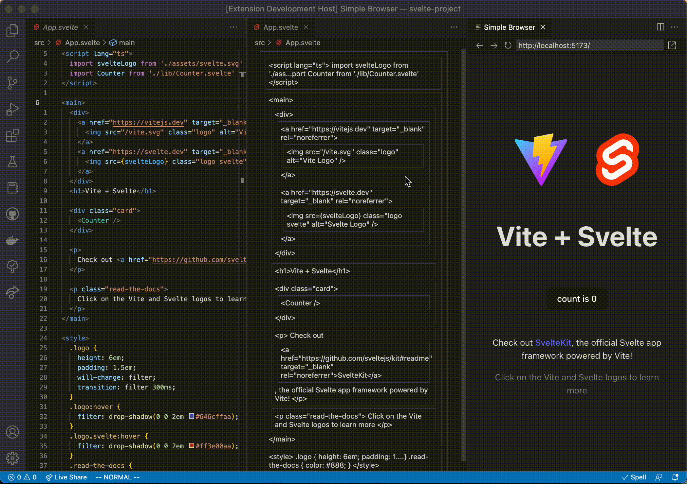

# Code Blocks

Move your code blocks around!

This extension allows you to move your code as blocks, **_in any language_\***.

Rust (technically just `cargo`) is required for this extension to work, go to [rust-lang.org](https://www.rust-lang.org/) to install it.

## Installation

1. Install the extension from:

   - Inside vscode, search for the `selfint.code-blocks` extension.
   - The [vscode marketplace](https://marketplace.visualstudio.com/items?itemName=selfint.code-blocks).
   - The GitHub [releases](https://github.com/selfint/code-blocks/releases?q=vscode-extension&expanded=true) page.

2. Open a file with the Code Blocks Editor, the `code-blocks-cli` will need to be downloaded
   by the method of your choosing (using `cargo` or downloading from the latest release).

3. Then the tree sitter grammar will be downloaded and compiled automatically.

That's it!

The next time you open a file in the same language, everything will already be setup.

If you open a file in a new language, the appropriate tree sitter grammar will be downloaded and compiled again.

### Installation from GitHub release demo


## Examples

### Block mode

In this mode, the current, previous, and next blocks are highlighted inside the editor.
Then, by running the "Move block up/down" commands, the current block is moved in the
appropriate direction.

#### Rust Example

> Moving method in and around `impl` block


> Moving `match` arms


#### Svelte Example

> Rapidly changing UI look


#### TypeScript + JSX Example

> Rapidly changing UI look


#### Python Example

**NOTE**: Force moving in Python almost never works correctly,
since whitespace is meaningful

> Moving methods and classes with decorators


#### Keybindings

No keybinding are set by default, by these are the recommended settings:

| Command                    | Keybinding     |
| -------------------------- | -------------- |
| `codeBlocks.moveUp`        | `ctrl+k`       |
| `codeBlocks.moveDown`      | `ctrl+j`       |
| `codeBlocks.moveUpForce`   | `ctrl+shift+j` |
| `codeBlocks.moveDownForce` | `ctrl+shift+k` |

### Code Blocks editor

This editor displays all blocks in the current file, in a custom editor.
To move a block, click the source block, and then the block to move it under.

#### TypeScript + JSX Example


#### Svelte Example



#### Rust Example

> Code blocks moving function attributes and documentation


> Code blocks not moving blocks between scopes


#### Python Example


## \*Supported languages

To support a language, [tree-sitter query](https://tree-sitter.github.io/tree-sitter/using-parsers#query-syntax)s are required to resolve blocks. This involves some manual
labour for each language, but not much.

Also, to use a language, a [tree-sitter grammar](https://tree-sitter.github.io/tree-sitter/creating-parsers#the-grammar-dsl) is required. There are [many grammars](https://github.com/tree-sitter) already written, but to use them they need to be compiled. The extension will
automatically download and compile the grammar for you, but it needs to know some metadata
about each grammar.

For now, these are the default configured languages:

- [x] Rust
- [x] TypeScript
- [x] TypeScript + JSX (typescriptreact)
- [x] Svelte
- [x] Python
- [x] Java

Next up:

- [ ] C#
- [ ] C
- [ ] C++
- [ ] JavaScript

### Adding a language

To add support for a language yourself, you'll need to:

1. Configure the installation method of the grammar.

2. Write the tree sitter queries for creating the blocks.

Here is an example of the configuration for Python:

```json
"codeBlocks.languageSupport": {
    "python": {
        "parserInstaller": {
            "downloadCmd": "git clone https://github.com/tree-sitter/tree-sitter-python",
            "symbol": "language",
            "name": "tree_sitter_python"
        },
        "queries": [
            "(class_definition) @item",
            "(function_definition) @item",
            "(decorated_definition) @item"
        ]
    }
}
```

For figuring out how to write the queries, use the
[Tree-sitter playground](https://tree-sitter.github.io/tree-sitter/playground).
