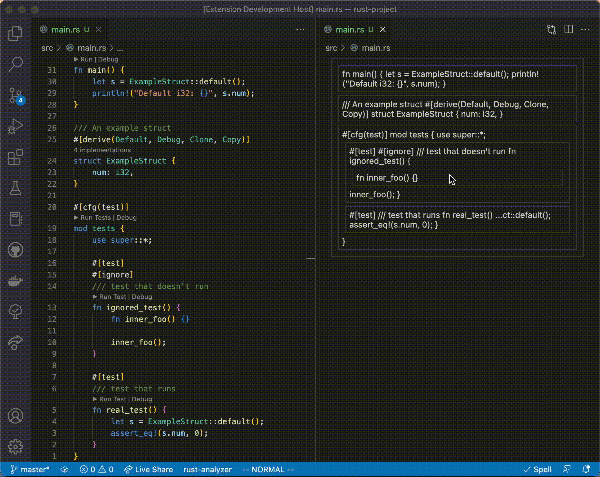
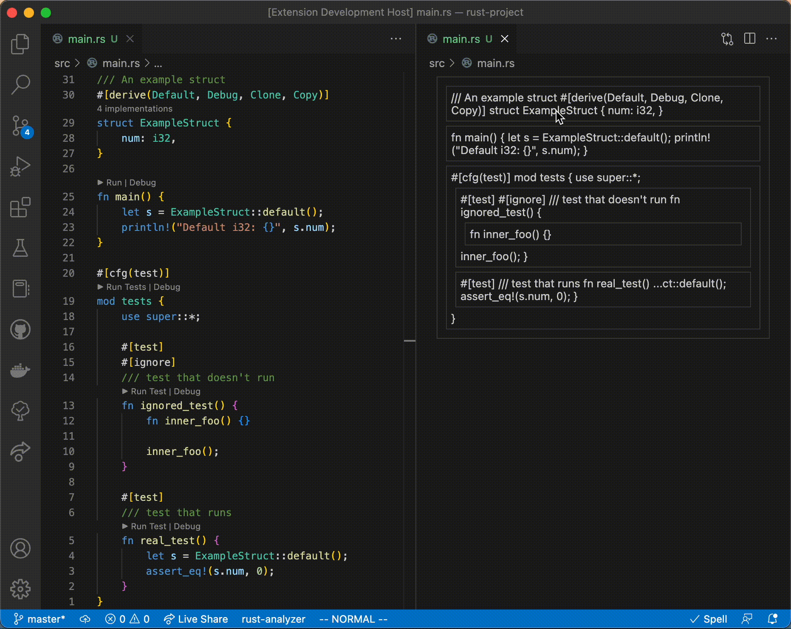

# Code Blocks

Move your code blocks around!

This extension allows you to move your code as blocks, **_in any language_\***.

## \*Supported languages

To support a language, [tree-sitter query](https://tree-sitter.github.io/tree-sitter/using-parsers#query-syntax)s are required to resolve blocks. This involves some manual
labour for each language, but not much.

Also, to use a language, a [tree-sitter grammar](https://tree-sitter.github.io/tree-sitter/creating-parsers#the-grammar-dsl) is required. There are [many grammars](https://github.com/tree-sitter) already written, but to use them they need to be compiled. Currently, only pre-compiled grammars
are supported. This should hopefully change soon, allowing for dynamically downloading and using grammars,
and for using user-specified queries.

For now, these are the languages with queries and compiled grammars:

- [x] Rust
- [x] TypeScript
- [x] TypeScript + JSX
- [x] Svelte

Next up:

- [ ] Python
- [ ] Java
- [ ] C#
- [ ] C
- [ ] C++
- [ ] JavaScript

## Examples

### TypeScript + JSX

### Svelte

### Rust

#### Code blocks moving function attributes and documentation

#### Code blocks not moving blocks between scopes

## Usage

Download the .vsix file from the latest Release, and install it in VsCode.

After opening a file with the Code Blocks Editor, the `code-blocks-cli` will need be downloaded
by the method of your choosing (using `cargo` or downloading from the latest release).

That's it!
